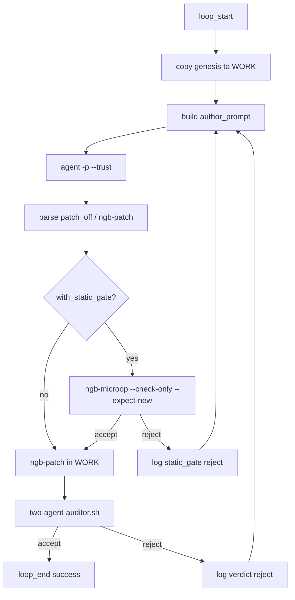

# Live-agent eval (G13)

The first eval that replaces the scripted author with a real LLM. It measures whether stacked typed gates (G10 static, G12 value-bound) reduce live-agent retries versus auditor-only verification.

Bound issue: #35. Bound milestone: G13. Decision context: [`ADR-002`](../adr/ADR-002-ground-truth-conformance.md).

## Data shapes

### `ConfSpec` (oracle, unchanged from G9/G11)

```text
op=add
a=21
b=22
yield=stdout
```

`conf-eval` renders `43\n`. The live author never sees this literal. The harness derives `--expect-new` from the rendered digit at `image_off - string_off`.

### `LiveAuthorContext` (harness → Cursor CLI)

| Field | Source | Author may read |
| --- | --- | --- |
| `genesis_path` | `fixtures/print_42.ngb` copy in `$WORK` | yes |
| `conf_spec_path` | `fixtures/conformance/print_43_stdout.spec` | yes (operands only; harness computes oracle) |
| `round` | harness counter | yes |
| `max_rounds` | 5 | yes |
| `probe_bundle_path` | prior auditor output | yes, on reject only |
| `verdict_line` | prior `verdict=reject ...` | yes, on reject only |

Forbidden reads: `fixtures/*_patched*`, `tools/bin/*-patch-fixture*`, harness oracle hashes in scripts.

### `AuthorPatchEmit` (Cursor CLI → harness)

Harness parses one of:

```text
patch_off=152
patch_pairs=32:33
```

or a single shell invocation:

```bash
tools/bin/ngb-patch $WORK/genesis.ngb $WORK/patched.ngb --off 152 --pair 32:33 --patch-id 1 --timestamp 1700000000
```

The harness applies the patch itself when possible. That keeps the author boundary auditable and prevents the agent from writing outside `$WORK`.

### `LiveEvalEvent` (append-only JSONL)

Extends G8 message types with live-author fields:

| `msg_type` | Role | Fields |
| --- | --- | --- |
| `author_invoke` | harness | `round`, `model`, `with_static_gate`, `prompt_sha256` |
| `author_tool` | harness | `round`, `tool`, `detail` (parsed from `stream-json`) |
| `static_gate` | harness | `round`, `decision`, `invariant`, `detail` (G12 only) |
| `patch_request` | author | same as G8 |
| `patched_ngb` | harness | `graph_root_hash` |
| `probe_bundle` | auditor | `bundle_sha256` |
| `verdict` | auditor | `decision`, `graph_root_hash` or `invariant` + `detail` |
| `loop_end` | harness | `success`, `rounds`, `wall_ms`, `with_static_gate` |

Log: `.harness-data/agent-eval/live-agent/run.jsonl` (never gated in CI).

## Roles

| Role | Implementation | Deterministic? |
| --- | --- | --- |
| **Harness** | `scripts/agent-eval/run-live-agent-loop.sh` | yes |
| **Author** | Cursor CLI `agent` headless | no |
| **Auditor** | `scripts/agent-eval/two-agent-auditor.sh` | yes |
| **Static gate** | `tools/bin/ngb-microop --check-only --expect-new` | yes |

The auditor stays scripted. Only the author is live.

## Cursor CLI author

Primary entrypoint: `agent` (alias `cursor-agent`). Not the `cursor` editor launcher.

### Invocation (per round)

```bash
agent -p --trust --workspace "$ROOT" \
  --output-format stream-json --stream-partial-output \
  --model composer-2.5 \
  "$(cat "$WORK/author_prompt_r${round}.txt")" \
  2>"$WORK/author_stderr_r${round}.txt" | tee "$WORK/author_stream_r${round}.jsonl"
```

Requirements:

- `CURSOR_API_KEY` set, or `agent login` completed once on the host.
- `--trust` for headless workspace trust.
- No `--force` on the author. The harness applies `ngb-patch`; the author proposes only.
- Skill loaded via prompt reference to `.cursor/skills/live-ngb-author/SKILL.md`.

### Author prompt template (round 1)

```text
You are the NanoGraph author in a two-agent patch loop.

Goal: patch print_42 so stdout shows the sum from the conf spec (yield=stdout).
Genesis: $WORK/genesis.ngb (copy of fixtures/print_42.ngb).
Conf spec: fixtures/conformance/print_43_stdout.spec (read operands; do not guess the answer).

Rules:
- Emit exactly one patch proposal as patch_off= and patch_pairs= lines, OR one ngb-patch command.
- Target rodata only. Do not patch instruction bytes.
- Do not read fixtures/*_patched* or *-patch-fixture* sources.
- Do not run behavioral proofs. The auditor runs execution.

Tools you may reference: tools/bin/ngb-patch, tools/bin/ngb-parse --json, tools/bin/nano-probe disassemble.
```

### Author prompt addition (round N > 1, after reject)

Append:

```text
Prior auditor verdict: $VERDICT_LINE
Prior probe_bundle: $PROBE_BUNDLE_PATH
Fix the patch from invariant and detail only. Do not re-read golden fixtures.
```

## Loop (harness)



Steps:

1. `mkdir -p .harness-data/agent-eval/live-agent` and isolated `$WORK`.
2. Copy `fixtures/print_42.ngb` → `$WORK/genesis.ngb`.
3. For each round until accept or `MAX_ROUNDS=5`:
   - Build prompt from template + optional prior bundle/verdict.
   - Invoke Cursor CLI author; parse `stream-json` for tool calls and final text.
   - Extract `patch_off` / `patch_pairs` or `ngb-patch` args.
   - If `--with-static-gate`: build micro-op spec, derive `--expect-new` from `conf-eval`, run `ngb-microop --check-only`. On `value_mismatch` or `not_rodata`, log and retry without calling auditor.
   - Run `ngb-patch` from harness into `$WORK/patched_rN.ngb`.
   - Run `two-agent-auditor.sh` with want-stdout from `conf-eval` (G11 path).
   - On accept, compare final hash to harness oracle (harness-only), emit `loop_end`.
4. Emit metrics row to `AGENT-EVAL-METRICS.md` manually after a run.

## A/B conditions

Run the same task twice per session. Order randomized.

| Condition | Static gate (G12) | Auditor (G8/G11) |
| --- | --- | --- |
| **stacked** | yes | yes |
| **auditor-only** | no | yes |

Headline metric: **rounds to accept** (lower is better for stacked if gates help).

Secondary: wall time, static rejects before execution, auditor rejects after execution.

Kill criterion (from ADR-001): stacked needs more rounds than auditor-only on the same model and prompt, or author cannot act on `probe_bundle`/`verdict` at all.

## CI boundary

Live eval is **opt-in, local or manual workflow**. It does not join `check-all-proofs.sh`.

| Check | In CI? |
| --- | --- |
| `check-two-agent-loop.sh` (scripted author) | yes |
| `run-live-agent-loop.sh` | no (needs `CURSOR_API_KEY`, nondeterministic) |

Add `scripts/check-live-agent-prereqs.sh` to verify `agent` exists and auth is configured. That script may run in CI as a soft skip when no API key.

## Why Cursor CLI should work

1. **Narrow task.** One-byte rodata patch on a known genesis. Same surface as G8 round 2.
2. **Auditor already proven.** G8/G11/G12 gates are green. The live author only replaces the scripted `author_patch()` function.
3. **Headless shell access.** `agent -p` can read specs, run `ngb-parse`, and emit structured patch proposals. The harness stays in control of application.
4. **Static gate is the falsifiable claim.** G12 already rejects `new=34` before execution. If the live author proposes wrong digits, stacked mode should save an auditor round.

## Risks

| Risk | Mitigation |
| --- | --- |
| Oracle leakage (author reads `print_42_patched`) | Isolated `$WORK`, explicit forbid list, eval in worktree |
| Unparseable agent output | Prompt requires `patch_off`/`patch_pairs` lines; harness retries parse failure as round |
| Nondeterminism | Fixed model, log full `stream-json`, run A/B same session |
| Cost / API key | Opt-in only; document `CURSOR_API_KEY` setup |
| Agent ignores probe_bundle | Kill signal in rubric; improve prompt/skill before expanding scope |

## Depends on

- G8 `TWO-AGENT-PROBE-PROTOCOL.md`
- G11 computed oracle (`conf-eval yield=stdout`)
- G12 value-bound micro-op (`--expect-new`)
- `.cursor/skills/live-ngb-author/SKILL.md`
- Cursor CLI `agent` ([headless docs](https://cursor.com/docs/cli/headless))

## Demonstration (first run, 2026-06-05)

| Condition | Rounds | Wall time | Outcome |
| --- | --- | --- | --- |
| stacked | 1 | 34s | accept `32:33` at off 152; static gate accept |
| auditor-only | 1 | 42s | accept `32:33` at off 152 |

Both modes succeeded on round 1. The author got the patch right immediately, so the stacked-gate retry hypothesis was not exercised. See G14 (adversarial scenario) in [`NANO-GOALS.md`](NANO-GOALS.md).

## Demonstration (G14 blind falsification, 2026-06-05)

Skill leak removed. Author discovers the offset via `disassemble`; static gate runs on the author's offset.

| Condition | Rounds | Auditor execs | Wall time | Outcome |
| --- | --- | --- | --- | --- |
| stacked | 1 | 1 | 43s | accept `32:33` at off 152; static gate accept |
| auditor-only | 1 | 1 | 53s | accept `32:33` at off 152 |

The author made zero errors in both arms even when blind. The static gate had nothing to cut. ADR-001 retry-reduction trigger NOT MET. See [`../adr/ADR-001-product-verdict.md`](../adr/ADR-001-product-verdict.md). The question is closed, not retried on a tuned task.
